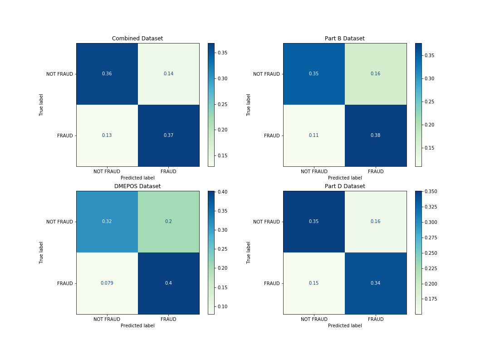
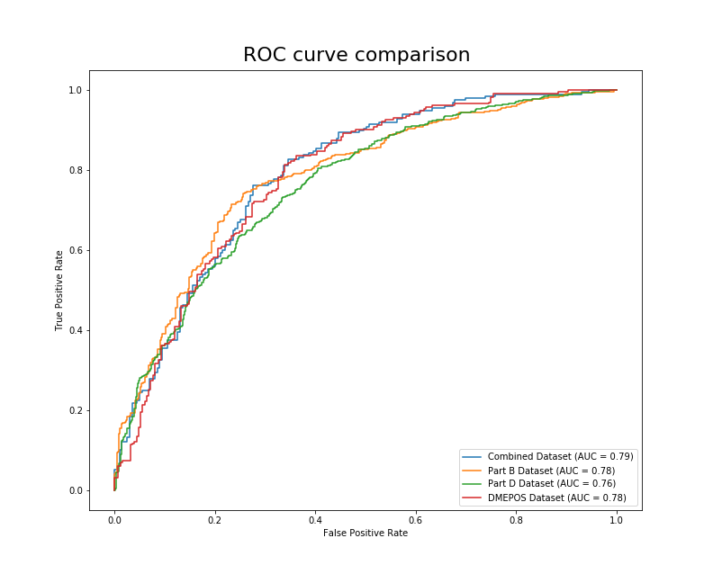
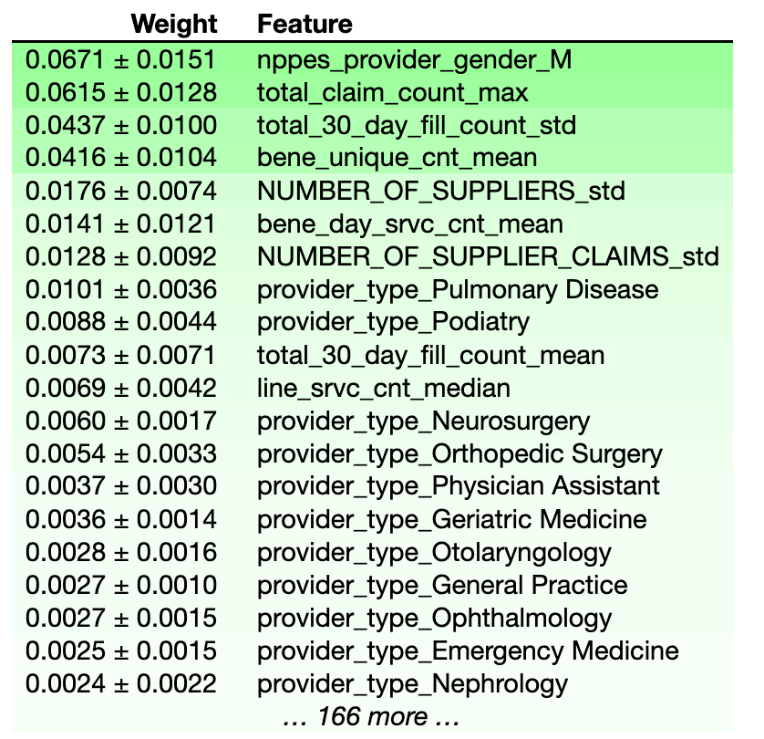
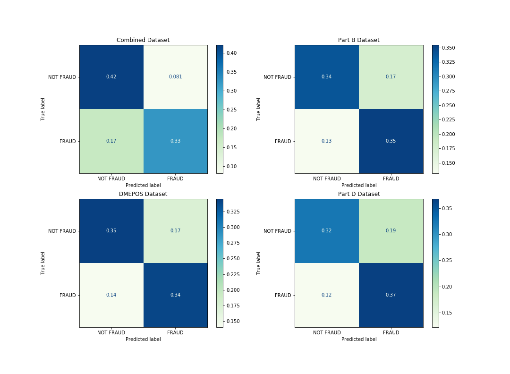
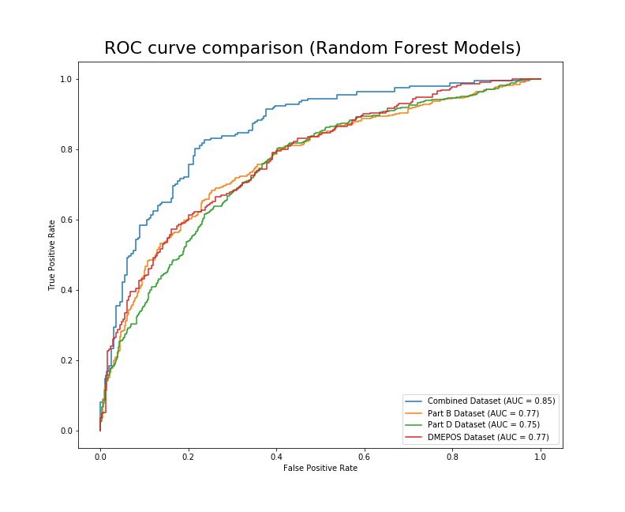
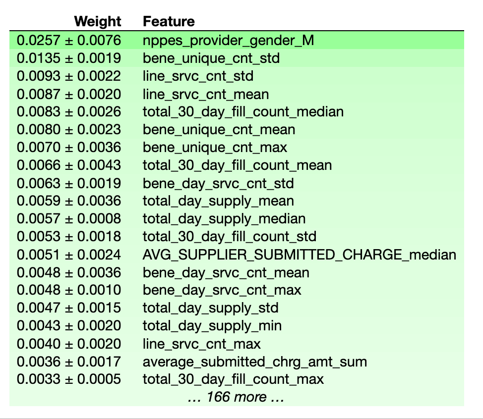

# Medicare Fraud Detection
Using data from multiple government sources to detect Medicare fraud. 

In the United States, Medicare is the national health insurance plan made primarily available to older citizens over the age of 65. This program is expensive, partly due to America’s aging population and sky-rocketing healthcare costs. It is financed through general government revenues (43%), payroll taxes (36%), and beneficiary premiums (15%). There are three main parts to the Medicare program:

- Medicare Part A : covers mostly inpatient hospital and hospice care.
- Medicare Part B: covers mostly hospital outpatient services, and prescriptions administered by a healthcare worker while in the hospital.
- [Medicare Part C](https://money.cnn.com/retirement/guide/insurance_health.moneymag/index16.htm): (aka - Medicare Advantage) are private plans subsidized by the government that need to offer the same coverage as Part A and Part B and are sometimes administered by private health insurance companies.

For this project, we also look into an aspect of the Medicare program, usually billed under Medicare Part B, knows as Durable Medical Equipment, Prosthetics, Orthotics and Supplies (DMEPOS).

## The Feature Data

We will be using data for Part D, Part B, DMEPOS, for our features. These datasets are released yearly by the Centers for Medicare & Medicaid Services ([CMS](https://www.cms.gov/)), and comprise specific information organized on a unique ID known as the [National Provider Identifier (NPI)](https://www.cms.gov/Regulations-and-Guidance/Administrative-Simplification/NationalProvIdentStand). This information is different for each of the three datasets, but includes features such as: submitted charges, utilization, average payments, provider gender, average submitted charges — to name a few.

This article is a high level overview of the project, so I will not get into the data processing specifics. If you are interesting in trying to replicate these results (or if you are a future reader who wants to incorporate data not available at the time of this writing) please check out the the data processing and modeling notebooks linked above. I will list the direct links to each dataset below:

- [Part D Data](https://www.cms.gov/Research-Statistics-Data-and-Systems/Statistics-Trends-and-Reports/Medicare-Provider-Charge-Data/PartD2015)
- [Part B Data](https://www.cms.gov/Research-Statistics-Data-and-Systems/Statistics-Trends-and-Reports/Medicare-Provider-Charge-Data/Physician-and-Other-Supplier)
- [DMEPOS Data](https://www.cms.gov/Research-Statistics-Data-and-Systems/Statistics-Trends-and-Reports/Medicare-Provider-Charge-Data/DME)

## The Target/Label Data

As mentioned before, all of the above mentioned datasets can be joined on the NPI, which is the unique identifier for each of the providers participating in the Medicare program. How would we know which NPI’s represented fraudsters?

Luckily, the Office of The Inspector General releases a naughty list of providers who are excluded from the medicare program for various reasons (including fraud!). This list is known as the List of Excluded Individuals/Entities (LEIE) and it can be downloaded [here](https://oig.hhs.gov/exclusions/exclusions_list.asp). The list is organized by NPI, and includes information such as the exclusion date, reinstatement date, and the exclusion type. The types of exclusions can be found in [this chart](https://oig.hhs.gov/exclusions/authorities.asp). Any physician who was active a year prior to their exclusion end year was labeled as a fraud. This chunk of time is the period before they had been caught, meaning that the data available for this period would reveal insights as to what fraud activity got these medical providers nabbed.

## Combined Dataset

Aside from the Part B, Part D, and DMEPOS datasets. A fourth dataset was created which combined features from each of those previously mentioned, joined together on the NPI. These 4 datasets were all modeled and evaluated separately to see which performed best.

## Models

For this project, I used two models in order to get an idea of feature importances and general performance. First, I used Logistic Regression to model all 4 datasets.

As you can see from the figure above, this may be a situation where good judgement comes into play. Which of the above models would you say is *best*? Let’s pretend we are working for the Office of The Inspector General, and we will be using this model to make decisions about who to investigate. To me, this is an informative visual to get a general idea of how each model is performing on the different data. If you follow the predictions of the DMEPOS model, you are going to catch more fraudsters than the other models. You will also be wasting more time and resources investigating innocent physicians. It might be a good idea to also look at the AUC before making any final decisions.

Now we can see that there is a 79% chance that the model trained on the combined data will be able to distinguish between the `FRAUD` and `NOT FRAUD` classes. Although this is close to the DMEPOS and Part B datasets’ AUC (.78), the combined dataset is the clear winner using this metric.

## Feature Importances (Logistic Regression)

What did the model think were important features when picking out these fraudulent physicians? We can use the [eli5](https://eli5.readthedocs.io/en/latest/overview.html) package to display feature importances for the model trained on the combined dataset.

Interestingly, whether or not the provider was Male seems to be the best predictor of whether they are engaged in fraudulent activities. I will list the other top features below:

- *`total_claim_count_max`* = The maximum number of Medicare Part D Claims, Including Refills
- *`total_30_day_fill_count_std`* = The standard deviation of the number of 30-Day Fills, Including Refills
- *`bene_unique_count_mean`* = The average number of unique Medicare Beneficiaries

We can infur from these results that most of the physicians that end up on the LEIE are getting into trouble for overprescribing medication. Let’s take a look at the information from the second model I used, a random forest.

From these confusion matrices, it seems that the model trained on the combined dataset would misclassify fraudulent physicians as legitimate more than any of the other models. The model trained on the Part D dataset has a slight bias towards predicting fraud, which could lead to wasting resources investigating legitimate physicians. Let’s look at the AUC for these models.

Now we can see that there is a 85% chance that the model trained on the combined data will be able to distinguish between the `FRAUD` and `NOT FRAUD` classes.

## Feature Importances (Random Forest)

Similar to logistic regression, the random forest model placed a lot of importance on the gender of the physician. Additionally, the definitions of the most important features in determining fraud are listed below.

- *`line_srvc_cnt_mean / line_srvc_cnt_std`* = Mean/Standard Deviation of the number of services provided.
- *`bene_unique_cnt_mean / bene_unique_count_max`* = Average/Max number of unique Medicare Beneficiaries.
- *`total_30_day_fill_count_median`* = The median number of 30-Day Fills, Including Refills

If you look at the feature importances from the logistic regression models and compare them to the random forest models, you will see that the logistic regression models appear to weigh their top features more heavily, while the random forest models seem to spread out the weights more uniformly.

## Conclusion

In the future, I plan on spending some more time trying to train this data on different models. I encourage you to do the same! I’m sure as time goes on and more data is collected the accuracy of state efforts to combat fraud will only improve. [Federal Regulation only began allowing data mining like what was described in this project in 2013 for Medicaid data](https://oig.hhs.gov/fraud/medicaid-fraud-control-units-mfcu/data-mining.asp). As more data is collected yearly, I expect there to be a drastic increase in the predictive power of these models — which hopefully makes these bad actors think twice before abusing the system.

### Sources

The methods used to perform the data preprocessing are described in [this article](https://journalofbigdata.springeropen.com/track/pdf/10.1186/s40537-018-0138-3.pdf), which is the basis for this project.

### Repository Structure
<pre>
├── data_processing.ipynb
├── images
│   ├── banner_image.jpeg
│   ├── forest_confusion.png
│   ├── logreg_ROC.png
│   ├── logreg_confusion.png
│   ├── logreg_features.png
│   ├── rand_forest_features.png
│   └── randforest_ROC.png
├── modeling.ipynb
└── readme.md
</pre>